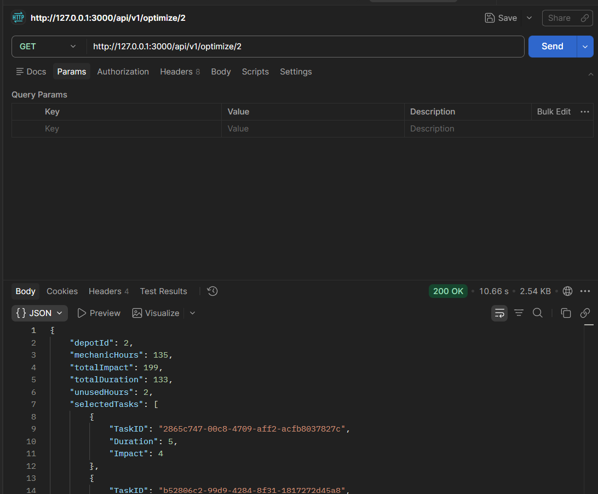
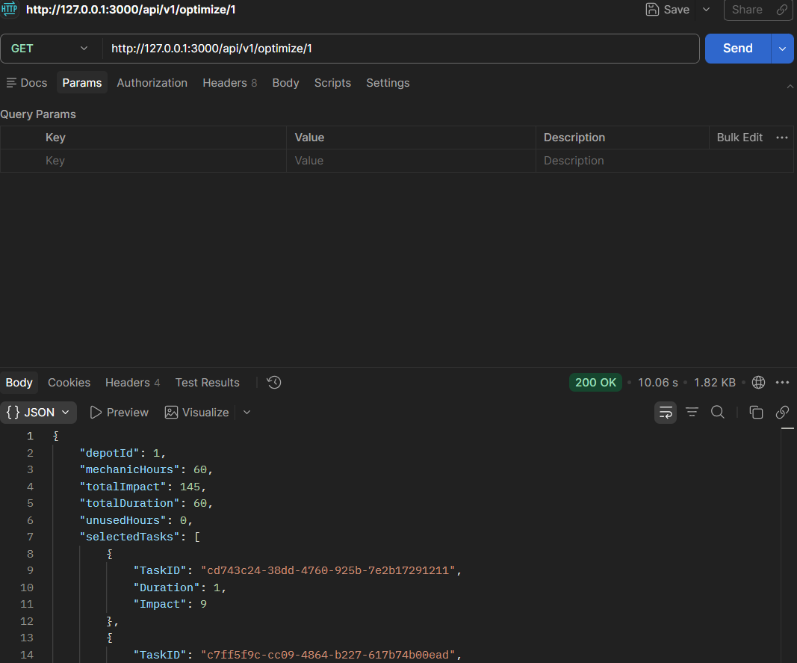
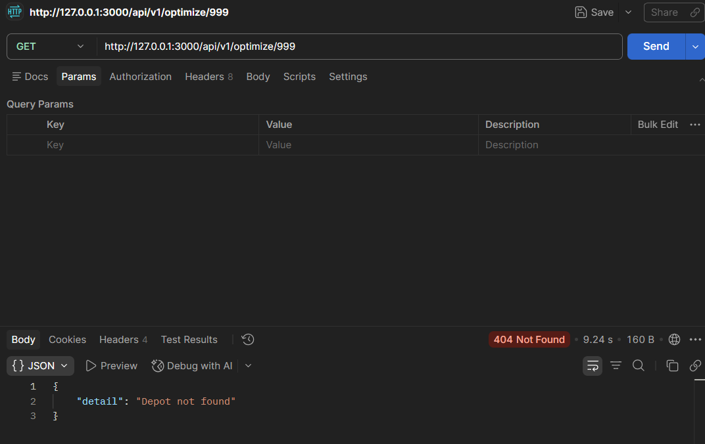
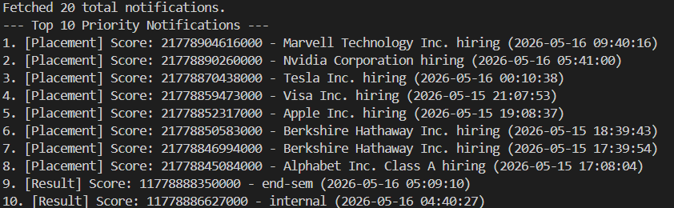

# Campus Backend Assessment

This repository contains the backend implementation for the Campus Notifications and Vehicle Maintenance systems. It was migrated to Python and built using FastAPI.

## Implemented Modules

*   **logging-middleware**: A reusable Python module that manages API authentication and async log posting. It handles token caching and validation safely.
*   **vehicle_maintence_scheduler**: A FastAPI service that implements a 0/1 Knapsack Dynamic Programming algorithm to optimize vehicle maintenance task selection based on mechanic hours and task impact.
*   **notification_app_be**: A priority sorting system that uses a custom MinHeap to rank and extract the top 10 notifications based on event type weights and recency.

## Tech Stack
*   Python 3.11+
*   FastAPI & Uvicorn
*   Pydantic
*   HTTPX

## Setup Instructions

Create a virtual environment and install the required dependencies:

```bash
python -m venv venv
venv\Scripts\activate
pip install -r requirements.txt
```

You must configure your `.env` credentials inside the `logging-middleware/` directory:
```env
EMAIL=
NAME=
ROLL_NO=
ACCESS_CODE=
CLIENT_ID=
CLIENT_SECRET=
```

## Run Commands

### Vehicle Maintenance Scheduler (FastAPI Server)
```bash
python -m uvicorn vehicle_maintence_scheduler.app:app --host 0.0.0.0 --port 3000
```

### Notification Priority System (Test Script)
```bash
python notification_app_be/test_priority_notifications.py
```

## API Endpoints

### Optimize Depot Tasks
`GET /api/v1/optimize/{depot_id}`
Calculates and returns the optimal subset of tasks for a depot. 
*Valid depot IDs: 2, 3, 4, 5.*

## Folder Structure

```text
├── logging-middleware/
│   ├── auth.py
│   ├── logger.py
│   └── validators.py
├── notification_app_be/
│   ├── priority_notifications.py
│   └── notification_service.py
├── vehicle_maintence_scheduler/
│   ├── app.py
│   ├── knapsack.py
│   └── services.py
├── notification_system_design.md
├── requirements.txt
└── README.md
```

## Screenshots

### Optimization API Responses




### Error Handling (Invalid Depot)


### Stage 6: Notification Ranking Output

